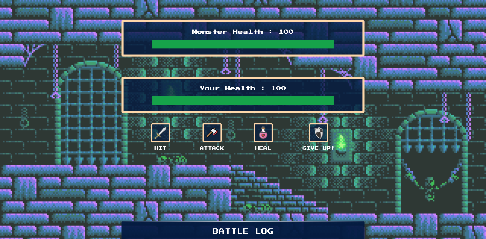

# Monster Slayer

> A simple monster slayer game made with react+vite+typescript+tailwind

[Demo](https://monster-slayer-007.netlify.app/)

## Getting Started

1. Clone this repo by running `git clone {REPO URL}`
1. You can run `npm run dev` to start the dev server on [http://localhost:5173](http://localhost:5173)
